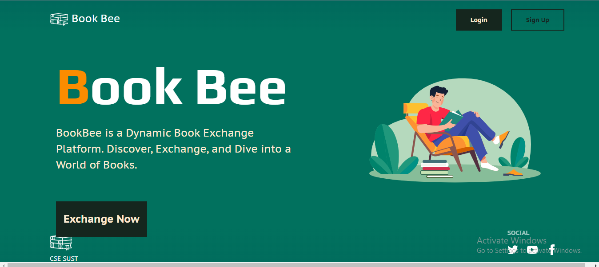

## Book-Bee - A Dynamic Book Exchange Platform
### About this project:
Book Bee is a platform designed to connect book enthusiasts who are willing to exchange books with others. This application will have features that will allow a user to be either a Contributor (someone who has books to give away) or a Beneficiary (someone who is looking for books).

### Start the project in your Local Machine:
Open up your terminal and write the below command:<br>
```
git init
```

```
git pull https://github.com/kabidhasan/book-bee-webapp.git
```
<br>
Now enter into the backend folder using below command:<br>

```
cd backend
```
<br>
To install all dependencies for this project write the command as follow:<br>

```
npm install
```
<br>
And to run the backend of the project you need to write the command:<br>

```
npm run dev
```
<br>

Now you can see the backend is running below like this:<br>

<br>

Now to run the fronend of this project you need to go the root directory of this project. Again you need to open another terminal.
Now enter into the softwer_project folder using below command:<br>

```
cd softwer_project
```
<br>
To install all dependencies for this project write the command as follow:<br>

```
npm install
```
<br>
And to run the frontend of the project you need to write the command:<br>

```
npm run dev
```
<br>

Now you can see the frontend is running below like this:<br>

<br>

The full project is now running on your local machine. <br>


Now go to your favourite browser and open the link  http://localhost:5173/ .<br>
You will see the landing page of this project like below:

